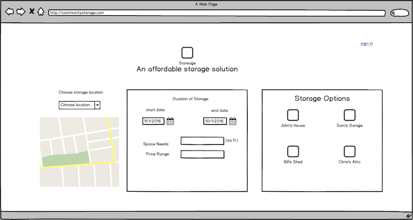
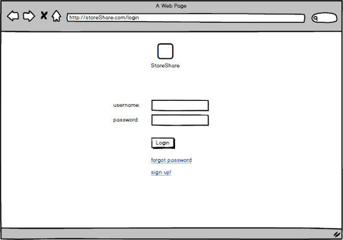
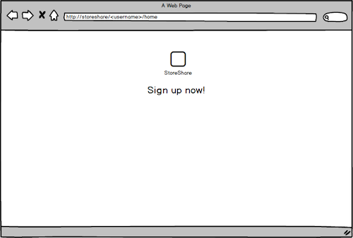
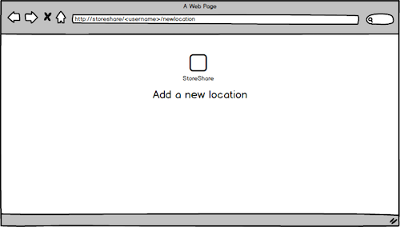
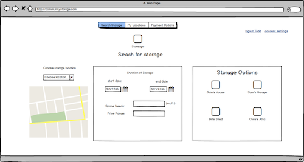
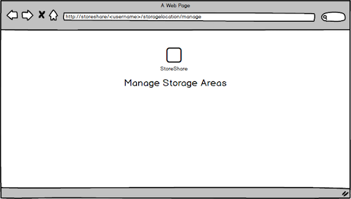

# StaShit

Java EE personal project

---

##Problem Statement
Finding space for short-term storage needs can be expensive and inconvenient. At the same time there are many property owners/renters that have extra space available that would be more than willing to store items for a small fee. The site connects those people. The target audience is college students and other groups who move frequently. 

##Project Technologies/Techniques (in progress...)
- Security / Authentication 
	- Phase one is to use Tomcats built in Auth
	- Phase two is to include 3rd party Authentication via other accounts such as Google or Facebook.
- Google Maps
	- Geocode addresses to display on a map
- Hibernate and MySQL
	- Store users, user information, and user roles
	- Store information about storage locations and spaces available
- Bootstrap
	- Add styling to site
- IntelliJ
	- For a coordinated development
- Log4j
	- To log errors
	- Want to log to different errors to different files

##Design

---

---

##Project Plan
The first half of the semester has been devoted to getting a simplistic version of all the technologies working in the project. I have achieved that so now the plan is:

Week | Object | Comment
---- | ---- | ----
Week 9 | Fill in any missing functions in the daos and write happy path tests | 
Week 10 | Write sad path tests and research other auth options |
Week 11 | Get Google maps fully working and added to DB |
Week 12 | Clean up JSP template system and start beautifying pages |
Week 13 | Start getting things ready for hosting |
Week 14 | Finish any last loose string |
Week 15 | Have site and db up on hosting site | 

##Development Journal
- [Development Journal]()