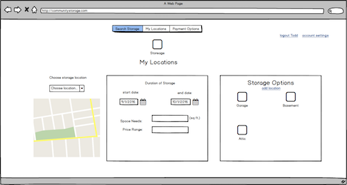

# storeShare/Shareage
###(name TBD)
Java EE personal project

---

##Problem Statement
Finding space for a short-term storage needs can be expensive and inconvenient. At the same time there are many property owners that have extra space available and would be more than willing to store items for a small fee. The site connects those people. The target audience is college students and other groups who move frequently. 

##Project Technologies/Techniques (in progress...)
- Google Maps
- Hibernate
- Bootstrap
- IntelliJ
- Log4j
- MySQL (need to figure out best DB option)

##Design

##Project Plan Link

##Development Journal
- [Development Journal]()